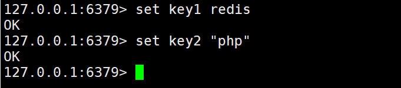
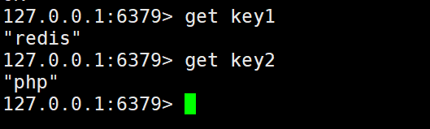
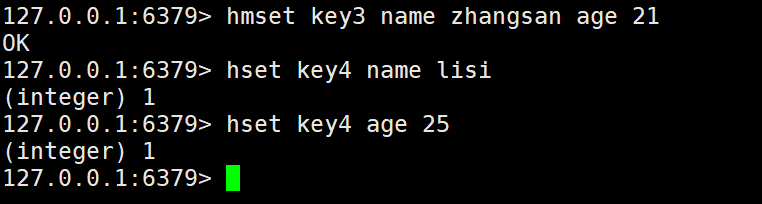
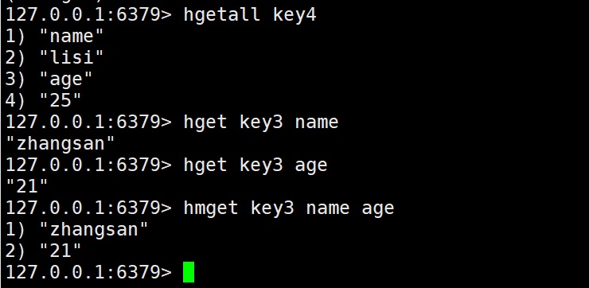
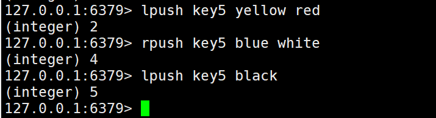
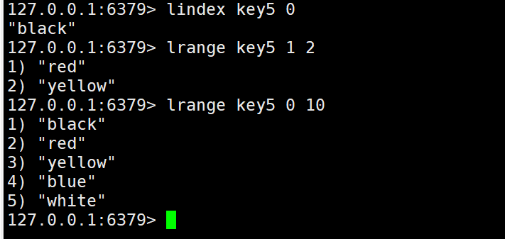
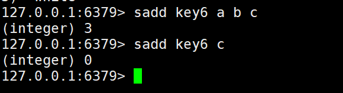
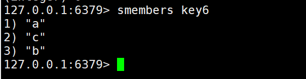
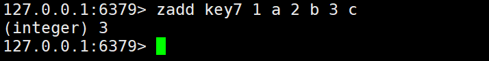
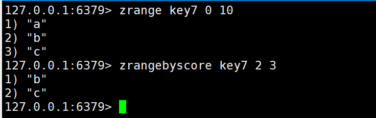

Redis
----

### string类型

#### 添加string类型
**语法**
```
set key value #设置指定 key 的值
```

**实例**
```
set key1 redis
set key2 "php"
```


#### 获取string类型的值
**语法**
```
get key  #获取指定 key 的值
```

**实例**
```
get key1
get key2
```


### hash类型

#### 添加hash类型
**语法**
```
hmset key field1 value1 field2 value2... # 同时将多个 field-value (域-值)对设置到哈希表 key 中
hset key field value # 将哈希表 key 中的字段 field 的值设为 value
```

**实例**
```
hmset key3 name zhangsan age 21
hset key4 name lisi
hset key4 age 25
```


#### 获取hash类型的值
**语法**
```
hgetall key         # 获取在哈希表中指定 key 的所有字段和值
hget key field      # 获取存储在哈希表中指定字段的值
hmget key field1 field2 # 获取所有给定字段的值
```

**实例**
```
hgetall key4
hget key3 name
hget key3 age
hmget key3 name age
```


### 列表(List)类型

#### 添加list类型
**语法**
```
lpush key value #在列表的头部添加一个或多个值
rpush key value #在列表的尾部添加一个或多个值
```

**实例**
```
lpush key5 yellow red
rpush key5 blue white
lpush key5 black
```


#### 获取list中的值
**语法**
```
lindex key index    #通过索引获取列表中的元素
lrange key start end #获取列表中指定范围内的元素
```

**实例**
```
lindex key5 0
lrange key5 1 2
lrange key5 0 10
```


### 集合(sort)

#### 添加sort类型
**语法**
```
sadd key members    #向集合添加一个或多个成员(重复元素会被忽略)
```

**实例**
```
sadd key6 a b c
sadd key6 c
```


### 获取集合中的成员
**语法**
```
smembers key     #返回集合中的所有成员
```

**实例**
```
smembers key6
```


### 有序集合(zsort)

#### 添加zsort类型
**语法**
```
zadd key score members    #向集合添加一个或多个成员(重复元素会被忽略)
```

**实例**
```
zadd key7 1 a 2 b 3 c
```


#### 获取有序集合中的成员
**语法**
```
zrange key start end   #通过索引区间返回有序集合指定区间内的成员
zrangebyscore key start end #通过分数返回有序集合指定区间内的成员
```

**实例**
```
zrange key7 0 10
zrangebyscore key7 2 3
```
