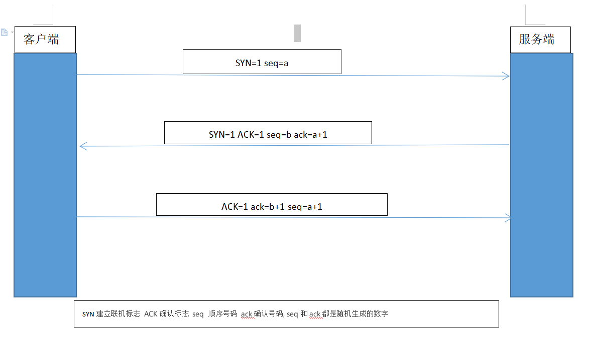
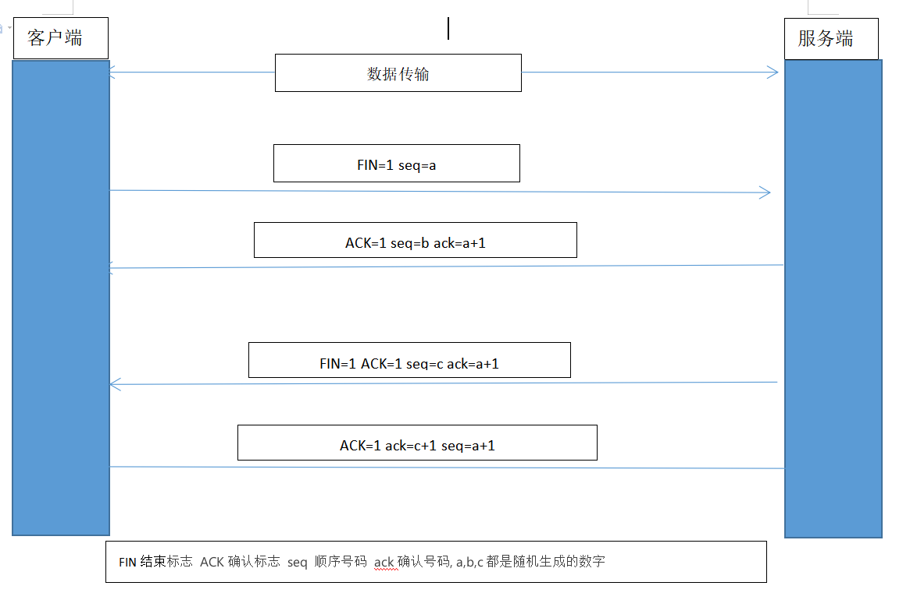

TCP三次握手
====

## 示意图

## 理解过程

### 第一次握手
**客服端向服务器发送一个SYN数据包（SYN=1 seq=a），告诉服务器需要建立连接的请求**

### 第二次握手
**服务器接收到SYN包后向客服端发送一个ACK包（ACK=1 ack=a+1）和一个SYN包（SYN=1 seq=b）,告诉客户端，服务器已收到建立连接的请求**

### 第三次握手
**客户端接收到SYN和ACK包后，确认有效后打开客户端这边的连接，并发送ACK（ACK=1 ack=b+1 seq=a+1）包到服务端，告诉服务器客户端这边的连接已建立完毕，要传输数据了，服务器收到ACK包后打开服务器这边的连接，TCP连接建立完成**

TCP四次挥手
====

## 示意图

## 理解过程

### 第一次挥手
**客户端向服务器发送一个FIN数据（FIN=1 seq=a）,告诉服务器需要断开连接的请求**

### 第二次挥手
**服务器收到FIN数据包后，立即返回一个ACK包（ACK=1 ack=a+1 seq=b）给客户端，告诉客户端，服务器已收到断开连接的请求，让客户端进入等待状态，但是此时服务器可能还有未发送完成的数据**

### 第三次挥手
**服务器确认数据发送完成后，发送一个FIN数据包（FIN=1 seq=c）和一个ACK包（ACK=1 ack=a+1）,告诉客户端数据发送完成，服务器可以关闭连接了**

### 第四次挥手
**客户端收到FIN数据包后进入超时等待状态，并发送一个ACK包（ACK=1 ack=c+1 seq=a+1）给服务器，服务器收到ACK包后立即关闭连接，客户端超时等待完成后才关闭连接。TCP连接关闭完成**